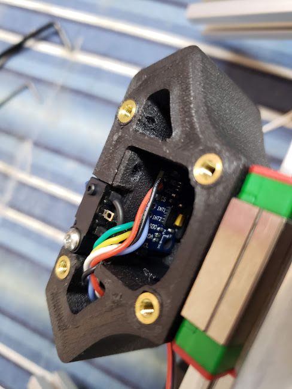
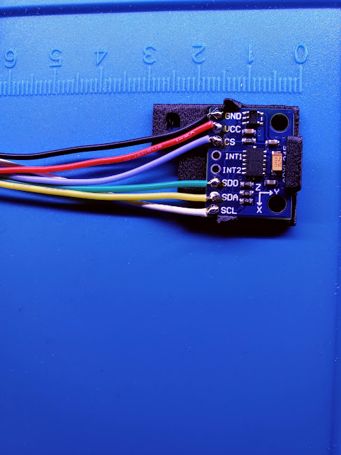

## ADXL345 mount for [Jubilee](https://github.com/machineagency/jubilee) center carriage

This small mod enables permanent installation of an ADXL345 accelerometer board inside of a Jubilee's center
carriage. The adapter can be printed separately from the center carriage and super-glued in place.
STEP files are included for the brave.

