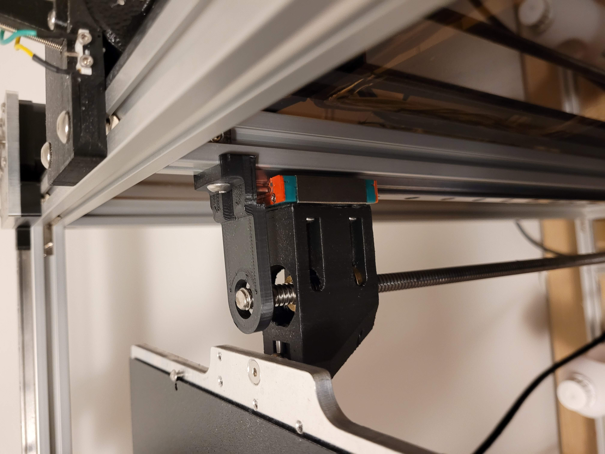

## Z Carriage and Lead screw retainers for [Jubilee](https://github.com/machineagency/jubilee)

For tall builds, lead screws on a Z axis can develop a resonance and start whipping around during
high-speed travel moves near Max Z. These Z carriage retainer modifications will keep your lead-screws in check.
With oversized holes these parts will not over-constrain the screw or attempt to correct its natrual whip during normal
moves, they will simply limit lateral movement to 3mm at the tip of the lead screw which should be plenty of space
unless the screws are really bent.

